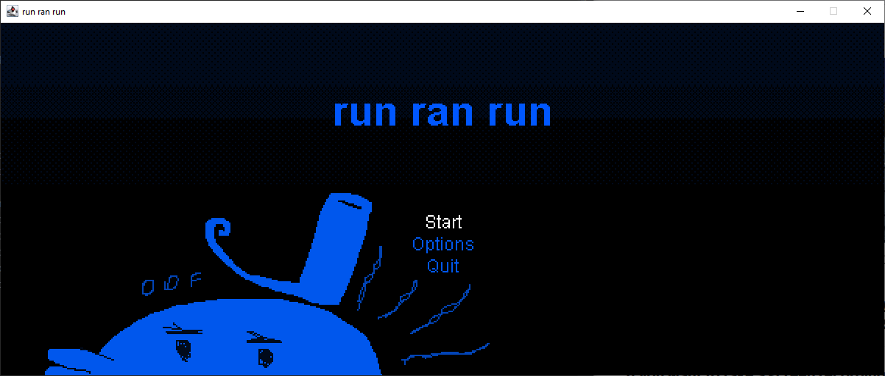
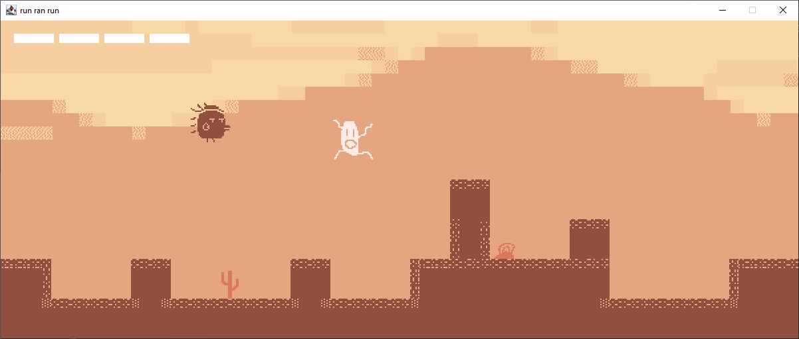
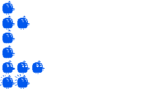

# FL4 (run ran run)

Run ran run is a 2-dimensional auto-runner / platformer that builds levels based on real-time weather information. 
It uses a single JPanel window to display a pixel-art scene consisting of a player avatar, terrain and various hazards. On game start, local weather information for Vienna is pulled from the Open weather map API and used as a seed do determine the audiovisual style of the game as well as the gameplay parameters. Broadly speaking, the game is played as follows: The player has control over a small avatar that automatically moves left to right at variable speeds. Uneven terrain has to be traversed without being pushed off the left side of the screen or falling into a pit. To this aim, the player can press the 'a' key to jump, or fall quickly to the ground if airborne. If the player is pushed back by the terrain, they will accelerate until a neutral position is regained. Additionally, hazards are occasionally spawned and need to be either evaded or parried. Coming into contact with them too many times in a row leads to a loss. The player also has the option of parrying hazards using the 's' key, causing the damage they would deal to be nullified and HP to gradually heal. The exact structure of the level as well as the positioning of hazards is generated from scratch on each playthrough and determined laregely by the weather. There is no win condition. One can only deter loss as long as possible.

Upon starting the software, players are presented with a simple menu screen with three choices: Start the game, change game options or quit. In the options screen, game sound can be toggled on or off. The other two options are self-explanatory. Once the gameplay proper starts. there are only two controls. 'a' is used for jumping when standing on the ground and fast-falling when airborne. 's', if pressed moments before making contact with a hazard, will allow the player to parry the damage. Once the player loses, they are presented with a game over screen informing them of the distance they have ran as well as the longest distance of their current session. There, they have the choice of going straight back to the gameplay or back to the main menu.

## Technical details

The game engine is an endless loop that updates and displays the game state on a fixed schedule of 60 frames per second, meaning that a single frame lasts ~17 milliseconds. Events and state changes are handled through a singleton class; the GameStateManger. It interfaces with all relevant classes by subdividing the game into states that all implement the following fundamental functionality:

 - An `update` function that advances the game logic by one frame and is called once per frame.
 - A `draw` function that draws the state of the game to the display buffer and is called once per frame.
 - A `reset` function that brings the state into a neutral condition, thus readying it for re-entry. It is called every time a state is exited.
 - A `startWorkers` function that restarts the activites related to a state. It is called once every time a state is entered. 
 
 The game assets are loaded from the `Resources` folder and is mostly formatted in the style of traditional sprite or tile sheets that contain individual animation frames for everything onscreen. There are two main kinds of gameplay objects one may encounter: Tiles and entities:

 - Tiles are the building blocks used to construct the level being played on. They all have the same dimensions and can have one of the following two properties: Passable or solid. Passable tiles have no collision and can be moved through. Solid tiles cannot be moved through.
 - Entities are more game objects with more complex internal logic and behavior, such as the player avatar and all hazards. They are placed on the level tilemap and interact with it by moving. They contain a large number of parameters such as size, collision data, health, speed, movement vector etc. Collision detection is handled through the four corners method. It has the benefit of being comparatively computationally cheap, and the constraint of not being able to handle collision boxes larger than the standard tile size. The update cycle for entities consists of two steps - in the first, the next position they would assume based on their current movement vector is determined, with no constraints. In the second step, that position is validated and modified based on factors such as their position inside the level and the presence of other entities.

_Example of an entity spritesheet_  

The level structure is a vector of tiles, loaded dynamically by a separate thread. Loading happens in predefined chunks. The pool of allowed chunks is determined by weather data. Tile images are loaded from a two-row tile sheet, where all tiles in the first row are passable and all tiles in the second row are solid. When the game enters the gameplay state, the worker thread is started in order to populate the level. This also happens when the player approaches the current edge of the level.

## Building the game

Run ran run is made almost 100% in base Java. The only external library is [`org.json`](https://github.com/stleary/JSON-java). In order to run a succesfull build you will need to add it to you dependencies. Additionally, since run ran run uses the Openweathermap weather API, no weather information can be accessed without a valid API key. The API call happens inside the `Networking.WeatherData` class, which imports the `Networking.APIKey` class and calls its `get` method to get the key in string format. In order to interface with the program, you will have to first [create your own key](https://openweathermap.org/api) adn then re-implement the `Networking.APIKey` class as described above.
